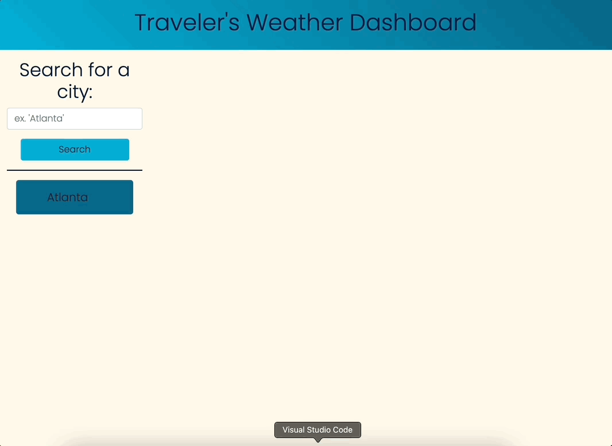

# Traveler's Weather Dashboard

As a traveler, knowing the weather of my destination is important to planning and packing for my trip accordingly. This Traveler's Weather Dashboard is a web-app for checking the current weather and 5-day forecast for a destination city.

### About

Developers are often tasked with retrieving data from another application's API and using it in the context of their own. The challenge here is to build a weather dashboard that will eature dynamically updated HTML and CSS powered by jQuery

View my finished application here: https://jcwashington.github.io/Travelers-Weather-Dashboard/


## User Story
```
    AS A traveler
    I WANT to see the weather outlook for multiple cities
    SO THAT I can plan a trip accordingly
```
## Acceptance Criteria
```
    GIVEN a weather dashboard with form inputs
    WHEN I search for a city
    THEN I am presented with current and future conditions for that city and that city is added to the search history
    WHEN I view current weather conditions for that city
    THEN I am presented with the city name, the date, an icon representation of weather conditions, the temperature, the humidity, the wind speed, and the UV index
    WHEN I view the UV index
    THEN I am presented with a color that indicates whether the conditions are favorable, moderate, or severe
    WHEN I view future weather conditions for that city
    THEN I am presented with a 5-day forecast that displays the date, an icon representation of weather conditions, the temperature, and the humidity
    WHEN I click on a city in the search history
    THEN I am again presented with current and future conditions for that city
    WHEN I open the weather dashboard
    THEN I am presented with the last searched city forecast 
```
### Site Mock-ups:





###  Functionality Contributions

- Weather information is provided by [OpenWeatherMap API](https://openweathermap.org/). [Documentation](https://openweathermap.org/api) can be found here.
- HTML and HTML semantic tags
- Bootstrap as as a CSS framework
  - minimises the need for media queries.
  - [Bootstrap Documentation](https://getbootstrap.com/docs/4.5/getting-started/introduction/)
- Google Fonts for custom fonts
- [jQuery](https://api.jquery.com/) powers the dynamic rendering of the html content based on user input
- [moment.js](https://momentjs.com/) is used to manipulate date values for historic data extraction from APIs